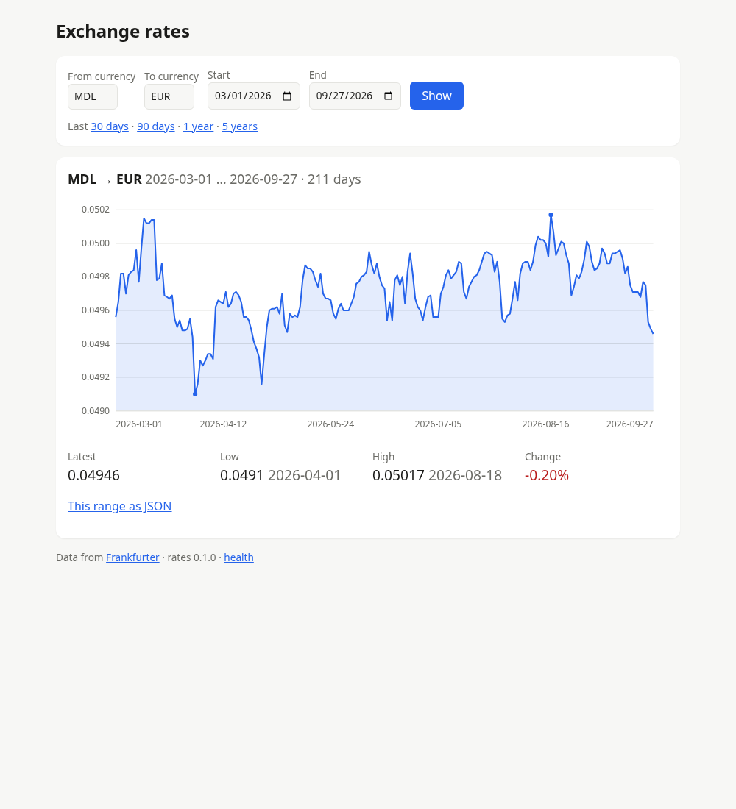

# Labs 04–05 — Jenkins and Ansible

One setup that covers both assignments:

- **Lab 04**: a Jenkins controller and an SSH build agent, with a pipeline that builds and tests an app.
- **Lab 05**: plus an Ansible agent and a test server, with pipelines that configure the server and deploy the app to it.

The app is **rates**, a Rust port of the [lab02](../lab02.nu) currency script with a web mode added,
so there is something to deploy and open in a browser. It replaces the PHP project from the assignments.

```
                    ┌──────────────────────────┐
  you ── :8080 ───▶ │ jenkins-controller       │  JCasC: admin user, credentials, nodes, jobs
                    └──────┬────────────┬──────┘
                    ssh (key 1)   ssh (key 2)
                  ┌────────▼───┐  ┌─────▼─────────┐
                  │ ssh-agent  │  │ ansible-agent │
                  │ rust-agent │  │ ansible-agent │
                  │ cargo test │  │ ansible-playbook
                  └────────────┘  └─────┬─────────┘
                        ▲ binary       ssh (key 3, user ansible)
                        └── Jenkins ──┐ │
                                    ┌─▼─▼──────────────────────┐
  you ── :8081 ───────────────────▶ │ test-server (systemd)    │
                                    │ httpd :80 ─▶ rates :3000 │
                                    └──────────────────────────┘
```



## Differences from the assignments

| Assignment | Here | Why |
|---|---|---|
| PHP project with PHPUnit | [`app/`](app): Rust, 56 tests, cargo-nextest | Not PHP; a port of lab02 so the course builds on itself |
| Docker + `docker-compose.yml` | Podman + `compose.yaml` (Docker works with an override) | Podman-first, like lab03 |
| `Dockerfile.*` | `Containerfile.*` | Same format, Podman's name |
| Set up Jenkins in the web UI | Configuration as Code ([`jenkins/`](jenkins)) | `compose up` gives a working Jenkins with everything configured; nothing to click |
| Plugins installed by hand | Baked into the controller image | Includes lab05's Docker, Docker Pipeline, GitHub and SSH Agent |
| Keys made with `ssh-keygen` by hand | [`setup.nu`](setup.nu) generates all keys, host keys and the admin password | Repeatable, and nothing secret gets committed |
| Agent label `php-agent` | `rust-agent` | Matches what it builds |
| Ubuntu Ansible agent | `jenkins/ssh-agent` + ansible-core | Same base as the build agent; sshd and Java come with it |
| Ubuntu test server, Apache + PHP | Fedora with systemd, Apache as a reverse proxy to the app | Behaves like a real server: services survive restarts and Ansible manages them with systemd |
| Ports `8080` and `50000` | Only `8080`, on `127.0.0.1` | `50000` is for inbound agents; both agents here connect over SSH |
| A pipeline created in the UI | A multibranch pipeline plus two pipeline jobs, all defined with Job DSL | Every branch gets built; the deploy is triggered automatically |

## Project structure

```
lab04-05/
├── setup.nu                    # generates secrets/ and .env (run once)
├── compose.yaml                # the four services
├── compose.docker.yaml         # Docker only: what systemd in test-server needs
├── Containerfile.controller    # Jenkins LTS + plugins + JCasC
├── Containerfile.ssh_agent     # jenkins/ssh-agent + pinned Rust toolchain and nextest
├── Containerfile.ansible_agent # jenkins/ssh-agent + pinned ansible-core
├── Containerfile.test_server   # Fedora 44, systemd as PID 1, sshd, ansible user
├── jenkins/
│   ├── plugins.txt             # plugins installed at image build time
│   ├── casc.yaml               # admin user, credentials, nodes (lab04/05 UI steps)
│   └── jobs.groovy             # Job DSL: the three jobs
├── pipelines/
│   ├── build_and_test.groovy   # lab04 Jenkinsfile / lab05 php_build_and_test_pipeline
│   ├── ansible_setup.groovy    # lab05 ansible_setup_pipeline
│   └── deploy.groovy           # lab05 php_deploy_pipeline
├── ansible/
│   ├── ansible.cfg
│   ├── hosts.ini               # inventory: test-server as user ansible
│   ├── setup_test_server.yml   # Apache, app user, systemd unit, virtual host
│   ├── deploy.yml              # copy the binary, restart, health check
│   └── templates/              # rates.service and the Apache virtual host
├── test_server/sshd.conf       # key-only logins as ansible
├── app/                        # the rates app (Rust)
├── docs/deployed.png
├── secrets/                    # generated, git-ignored
└── .env                        # generated, git-ignored (public keys only)
```

## Quick start

Requires Podman with `podman compose` (podman-compose or docker-compose as the provider) and [nushell](https://www.nushell.sh).

```sh
cd lab04-05
nu setup.nu                      # keys, host keys, admin password, .env
podman compose up -d --build     # first build takes a few minutes (Rust toolchain, plugins)
```

- Jenkins: <http://localhost:8080>, user `admin`, password in `secrets/admin_password`
- The app on the test server: <http://localhost:8081>, once the first deploy has run

Jenkins scans the repo every 5 minutes. To start right away, open **rates: build and test** and click **Scan Repository Now**.
A green build of `main` deploys by itself. The test server starts empty, and the first deploy configures it.

Both ports are bound to `127.0.0.1` only.

### Docker

Docker works too. The test server runs systemd, which needs the host's cgroup tree and some tmpfs mounts.
Podman sets those up by itself; Docker gets them from `compose.docker.yaml`:

```sh
nu setup.nu
docker compose -f compose.yaml -f compose.docker.yaml up -d --build
```

### Settings

Set these in the environment or in `.env`:

| Variable | Default | What it does |
|---|---|---|
| `REPO_URL` | `https://github.com/nickmessing/automation.git` | Repository the jobs clone |
| `REPO_BRANCH` | `main` | Default branch for the ansible-setup and deploy jobs |
| `DEPLOY_BRANCH` | `main` | Branch whose green builds trigger a deploy |

To try changes from a branch before merging it: `REPO_BRANCH=my-branch DEPLOY_BRANCH=my-branch podman compose up -d`.

### Stopping and resetting

```sh
podman compose down                  # keep Jenkins' data and build history
podman compose down -v               # also delete the volumes (Jenkins starts fresh)
podman compose up -d --force-recreate test-server   # a blank test server again
nu setup.nu --force                  # new keys and password (then recreate everything)
```

## Lab 04: Jenkins

### Setting up the Jenkins controller

The assignment's steps are done by [`Containerfile.controller`](Containerfile.controller) and [`jenkins/casc.yaml`](jenkins/casc.yaml):

1. **Image**: `jenkins/jenkins:2.568.3-lts-jdk21`, with the plugins from [`plugins.txt`](jenkins/plugins.txt)
   installed at build time by `jenkins-plugin-cli`.
2. **Setup wizard**: skipped (`-Djenkins.install.runSetupWizard=false`). Instead, JCasC creates the `admin` user
   with the password from `secrets/admin_password`, turns off sign-up and blocks anonymous access.
3. **Built-in node**: 0 executors. Builds only run on agents, as Jenkins recommends.
4. **Storage**: `jenkins_home` is a named volume, so build history survives restarts.

The configuration is reapplied on every start, so changes made in the UI don't last.
To change something, edit `casc.yaml` and run `podman compose up -d --build jenkins-controller`.

### Setting up the SSH agent

1. **Keys**: `setup.nu` generates `secrets/jenkins_ssh_agent_key` (ed25519). The public half goes into `.env`
   as `JENKINS_AGENT_SSH_PUBKEY`, which the `jenkins/ssh-agent` image writes to `~jenkins/.ssh/authorized_keys`.
2. **Image**: [`Containerfile.ssh_agent`](Containerfile.ssh_agent) adds Rust 1.98.1 (via rustup) and cargo-nextest,
   both checksum-verified. It's the counterpart of the assignment's `php-cli` line.
3. **Credential**: JCasC registers the private key as `ssh-agent-key` (user `jenkins`, scope SYSTEM),
   the equivalent of *Manage Credentials → Add SSH key*.
4. **Node**: JCasC creates the permanent agent `ssh-agent1`:

   | Setting | Value |
   |---|---|
   | Label | `rust-agent` |
   | Remote root directory | `/home/jenkins/agent` (the `jenkins_agent_volume` volume) |
   | Launch method | Launch agents via SSH, host `ssh-agent`, credential `ssh-agent-key` |
   | Host key verification | Manually provided key: the host key from `secrets/`, so the first connection can't be intercepted either |

Check it under **Manage Jenkins → Nodes**: `ssh-agent1` should be online.
Its log shows `SSH host key matched the key required for this connection`.

### The build pipeline

[`pipelines/build_and_test.groovy`](pipelines/build_and_test.groovy) is the assignment's Jenkinsfile, filled in for Rust:

| Stage | What it does |
|---|---|
| Checkout | Clones the repo |
| Install Dependencies | `cargo fetch --locked` |
| Lint | `cargo fmt --check`, `cargo clippy -D warnings` |
| Test | `cargo nextest run`; the JUnit report shows up under **Tests** |
| Release Build | `cargo build --release`, and archives `target/release/rates` |
| Deploy | Only on `DEPLOY_BRANCH`: starts the deploy job with this build's binary |

The `post` block keeps the assignment's `always`, `success` and `failure` messages.

The job **rates: build and test** is a *multibranch pipeline* (defined in [`jobs.groovy`](jenkins/jobs.groovy)).
It builds every branch that contains this file and rescans every 5 minutes, because Jenkins on localhost
can't receive GitHub webhooks.

## Lab 05: Ansible

### The Ansible agent

[`Containerfile.ansible_agent`](Containerfile.ansible_agent) is `jenkins/ssh-agent` with ansible-core 2.21.4
in a virtualenv, plus the `ansible.posix` collection. Jenkins connects to it the same way as to the build agent:
node `ansible-agent1`, label `ansible-agent`, its own key pair (`jenkins_ansible_agent_key`) and its own verified host key.

The agent has **no key for the test server**. The pipelines load the `test-server-key` credential into an
ssh-agent only for the duration of the step, using the SSH Agent plugin:

```groovy
sshagent(credentials: ['test-server-key']) {
    sh 'ansible-playbook setup_test_server.yml'
}
```

The test server's host key is mounted as `/etc/ssh/ssh_known_hosts`, so Ansible keeps host key checking on.

### The test server

[`Containerfile.test_server`](Containerfile.test_server) is Fedora 44 with **systemd as PID 1**. Podman
detects `/sbin/init` and sets up the container for systemd. The image contains:

- `openssh-server`, set up by [`sshd.conf`](test_server/sshd.conf): key-only logins, no root login, only the `ansible` user.
- An `ansible` user with passwordless `sudo`. Its `authorized_keys` is `secrets/ansible_test_server_key.pub`, mounted read-only.
- `python3` and `python3-libdnf5`, which Ansible needs on the server for its modules and for `dnf`.

Nothing else is installed. The server starts blank, and everything after that is Ansible's job.

### The playbook: `setup_test_server.yml`

Inventory ([`hosts.ini`](ansible/hosts.ini)): `test-server`, user `ansible`, `become: true`.

| Task | Module | Result |
|---|---|---|
| Install Apache | `dnf` | `httpd` installed |
| Create the rates system user | `user` | Unprivileged `rates` user for the service |
| Create the application directory | `file` | `/opt/rates` |
| Install the rates systemd unit | `template` | [`rates.service`](ansible/templates/rates.service.j2): runs `rates serve` on `127.0.0.1:3000`, restarts on failure |
| Disable the default welcome page | `copy` | Fedora's test page no longer answers `/` |
| Configure the virtual host | `template` | [`rates.conf`](ansible/templates/rates-vhost.conf.j2): proxies `/` to the app, with its own logs and a 503 message until the first deploy |
| Allow Apache to proxy (SELinux) | `ansible.posix.seboolean` | `httpd_can_network_connect`; only runs where SELinux is enabled (a real server, not the container) |
| Start Apache / enable rates | `systemd_service` | Both start at boot |

Handlers run `httpd -t` before reloading Apache, and restart the app only if it is already running.
The playbook is idempotent: a second run reports `changed=0`.

[`deploy.yml`](ansible/deploy.yml) imports the setup playbook first, so it also works on a blank server. Then it:

1. Checks that a binary was passed (`-e rates_binary=...`).
2. Keeps the deployed version as `rates.previous`, if it differs from the new one.
3. Copies the new binary and restarts the service only if the binary changed.
4. Waits for port 3000, then checks `/health` both directly and through Apache.

### The pipelines

| Job | File | Agent | Stages |
|---|---|---|---|
| rates: build and test | `build_and_test.groovy` | rust-agent | Checkout, Install Dependencies, Lint, Test (JUnit), Release Build, Deploy |
| test-server: configure with ansible | `ansible_setup.groovy` | ansible-agent | Checkout, Check Playbook (`--syntax-check`), Configure Test Server |
| test-server: deploy rates | `deploy.groovy` | ansible-agent | Checkout, Fetch Build (Copy Artifact), Deploy (`deploy.yml`), Smoke Test (curl `/health`, the API and the page) |

The deploy job's parameters say which build to deploy (`SOURCE_JOB`, `SOURCE_BUILD`), so any earlier build
can be redeployed by hand. The build job grants it access with `copyArtifactPermission('/deploy')`.

### Testing the deployed app

Open <http://localhost:8081>. It shows the last 30 days of EUR → USD. Change the currencies or dates,
or use the presets (30 days … 5 years). The screenshot at the top is MDL → EUR for March–September 2026, served by the test server.

From the command line:

```sh
curl localhost:8081/health                                 # {"status":"ok","version":"0.1.0"}
curl localhost:8081/api/rate/EUR/MDL?date=2024-03-15       # one rate
curl "localhost:8081/api/rates/EUR/USD?from=2024-03-01&to=2024-03-31"
podman exec test-server systemctl status rates httpd
podman exec test-server journalctl -u rates -f             # request log
```

## The app: rates

```sh
cd app
cargo run -- rate EUR USD 2024-03-15                  # like lab02: prints and saves data/*.json
cargo run -- rate EUR JPY --from 2024-01-01           # a range, with lab02's braille graph
cargo run -- serve                                    # http://127.0.0.1:3000
cargo nextest run                                     # or: cargo test
```

| Module | What |
|---|---|
| `api` | Frankfurter client (reqwest + rustls) |
| `validate` | Currency and date checks, with lab02's error messages |
| `store` | `data/<BASE>-<QUOTE>-<DATE>.json` and `error.log` |
| `chart` | The braille terminal graph from lab02, ported line by line |
| `svg` | Server-side SVG chart for the web page (light and dark mode) |
| `web` | axum: `/`, `/api/rate/{base}/{quote}`, `/api/rates/{base}/{quote}`, `/health`; logs every request; stops cleanly on SIGTERM |
| `cli` | The `rate` command |

The tests run against a fake Frankfurter server (wiremock), so they need no network.
The toolchain is pinned in `rust-toolchain.toml`, matching the agent image.

## Questions

### Lab 04

**What are the advantages of using Jenkins for DevOps task automation?**

- It's free, self-hosted and not tied to one code host. The same Jenkins can build from GitHub, GitLab or a plain git server.
- Pipelines are code (a Jenkinsfile in the repo), so they're reviewed and versioned like the rest of the project.
  With JCasC and Job DSL, the whole server is code too. This setup can be rebuilt from nothing with one command.
- Builds run on agents, so each job gets the tools it needs (Rust here, Ansible there) without installing
  everything in one place, and more agents can be added to run builds in parallel.
- There are plugins for almost everything: test reports, artifacts, credentials, SSH, Docker, notifications.
- Credentials are stored centrally and scoped. Here the test server key is only available inside an `sshagent` block,
  and the agent keys can't be used by pipelines at all.
- Multibranch pipelines, triggers between jobs, parameters and a build history with logs, test trends and artifacts.

**What other types of Jenkins agents exist?**

- **Permanent SSH agents**: what this lab uses. The controller connects to a machine over SSH and starts the agent.
- **Inbound agents** (formerly JNLP): the agent connects to the controller over TCP port 50000 or WebSocket.
  Useful when the controller can't reach the agent, for example behind NAT or on Windows.
- **Cloud and ephemeral agents**: created per build and removed afterwards. Examples are the Docker plugin (a container per build),
  Kubernetes (a pod per build), and EC2, Azure VM or GCE instances.
- **Docker agents in a pipeline**: `agent { docker { image 'rust:1.98' } }` runs the steps inside a container on an existing agent.
- **The built-in node**: the controller itself. It's disabled here (0 executors), because running builds
  on the controller is a security risk.

**What problems did you encounter when setting up Jenkins and how did you solve them?**

- **The Rust toolchain was not on `PATH` in builds.** The `jenkins/ssh-agent` entrypoint only copies environment
  variables containing `_` into SSH sessions, so `RUSTUP_HOME` got through but the image's `PATH` did not.
  I set `PATH+RUST=/opt/cargo/bin` as a node property in JCasC. It's the same fix for Ansible (`PATH+ANSIBLE`).
- **The controller couldn't read its keys.** With rootless Podman, files bind-mounted from the host belong to
  root inside the container, and Jenkins runs as uid 1000. `setup.nu` makes the files the controller reads
  world-readable, but keeps the `secrets/` directory at `700`, so other users on the host still can't get in.
- **Host key verification.** Assignment guides usually pick "Non verifying". Instead, `setup.nu` generates host keys for every
  SSH server, mounts them into the containers, and gives Jenkins and Ansible the public halves. So every connection is
  verified from the start. `ssh-keygen -A` in the agent image only creates keys that are missing, so the mounted ones are kept.
- **No webhooks on localhost.** GitHub can't reach `localhost:8080`, so the multibranch job rescans every 5 minutes instead.
- **Testing the pipelines before merging.** The multibranch job skips `main` until this folder is merged.
  `REPO_BRANCH` and `DEPLOY_BRANCH` let the whole chain (build, auto-deploy, smoke test) run from the feature branch first.

### Lab 05

**What are the advantages of using Ansible for server configuration?**

- **Agentless.** It only needs SSH and Python on the server. There's nothing to install or keep running there.
- **Declarative and idempotent.** Tasks describe the desired state ("httpd is installed and running"), so running a playbook
  again is safe. Here a second run reports `changed=0`, and the deploy only restarts the app when the binary changed.
- **Readable.** Playbooks are YAML that doubles as documentation of how the server is set up.
- **Reusable.** Templates (Jinja2), variables, handlers, roles and collections. One playbook works for one server or a hundred.
- **Safe to preview.** `--syntax-check`, `--check` and `--diff` show what would change before anything does.
- **Fits CI/CD.** It's just a command, so Jenkins runs it like any other build step, with credentials injected only for that step.

**What other Ansible modules exist for configuration management?**

- **Packages**: `package`, `dnf`, `apt`, `pip`
- **Services**: `systemd_service`, `service`
- **Files**: `copy`, `template`, `file`, `lineinfile`, `blockinfile`, `replace`, `unarchive`, `get_url`, `fetch`
- **Users and access**: `user`, `group`, `ansible.posix.authorized_key`, `community.general.sudoers`
- **System**: `hostname`, `cron`, `mount` (ansible.posix), `sysctl` (ansible.posix), `timezone` (community.general)
- **Security**: `ansible.posix.seboolean`, `community.general.sefcontext`, `ansible.posix.firewalld`, `community.general.ufw`
- **Code and checks**: `git`, `uri`, `wait_for`, `assert`, `stat`
- **Applications**: `community.mysql.mysql_db`, `community.postgresql.postgresql_db`, `community.docker.docker_container`, `kubernetes.core.k8s`

**What problems did you encounter when creating the Ansible playbook and how did you solve them?**

- **A condition that checked the wrong machine.** The first version of the "restart rates" handler used
  `when: path is file`. Jinja tests run on the Ansible agent, not on the server, so it checked the agent's filesystem.
  The fix was `systemctl try-restart rates`, which restarts the service only if it is running. That's exactly
  the right behaviour before the first deploy.
- **SELinux inside a container.** On a real Fedora server, Apache may only proxy to the app with
  `httpd_can_network_connect`. The container has no SELinux of its own, so the task only runs when the gathered facts
  say SELinux is enabled.
- **Package management on Fedora 44.** `dnf` is dnf5 there, and Ansible needs `python3-libdnf5` on the server.
  It's installed in the test server image.
- **systemd in a container.** An Ubuntu container without systemd can't run services properly: nothing restarts them,
  and they don't survive a reboot. With systemd as PID 1, Ansible manages Apache and the app like on a real server.
  Podman supports this out of the box; Docker needs `compose.docker.yaml`.
- **Deploying to a blank server.** `deploy.yml` imports the setup playbook, so the deploy works even if
  ansible-setup never ran. I tested this by recreating the test server and letting a build deploy to it.
- **Backups without noise.** Copying the old binary to `rates.previous` on every run would always report "changed".
  The playbook compares checksums first and only backs up when a different version is being deployed.
